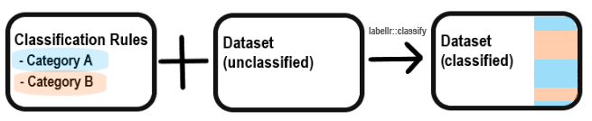

*Incomplete*

```{r, include=FALSE}
## get locations of files
package_loc <- system.file(package = "labellr")
ext_path <- file.path(package_loc, "extdata")
```

## Introduction

The motivation behind `labellr` is the following. You need to categorise each row of a dataset into 
one of (many) possible levels of a summary/grouping variable. This categorisation can be done according to a set
of rules that are defined in advance (i.e. we are in a deterministic setting). Writing code that performs this categorisation may be lengthy, making it difficult to debug and understand. For example, you may have a medical
dataset that contains results of various measurements, diagnosis codes and treatment outcomes but that 
needs the addition of one or more summary variables to allow convenient analysis.  

The goal of `labellr` is to enable the use of tabular files (e.g. MS Excel) in defining each level of the summary/grouping variable according to set of rules (e.g. the presence/absence of a condition) - a *definitions table*. This *definitions table* of rules is then used by `labellr::classify` to categorise each row of the analysis dataset into one (or more) of the levels of the summary/grouping variable.



## Defining your summary categories

As an example, suppose a medical clinic performs either X-ray, FMRI or minor surgery. A sample of their data is: 
```{r}
clinic_data <- read.csv(file.path(ext_path, "clinic_data.csv"), stringsAsFactors = FALSE)
head(clinic_data)
```

Using  your preferred tabular data editor you outline the rules that define each level of the summary variable 'treatment'. (Alternatively these can be built in R using tbd). A first step is to indicate the datatype for each variable that will be used in the data classification. `labellr` uses three datatypes, `date`, `numeric` and `character` - which should indicated in the `datatype` row of the definitions table. `numeric` and `character` are equivalent to the respective R classes, whereas `date` is currently not tested against an R class due to a limited set of possible classification rules.

There exist different rulesets depending on the datatype chosen (below is from `?labellr::classify`):

_Rulesets for variable type `numeric`_:  

* present/absent: indicate that a value must be present (i.e. cannot be NA) with "1", and that a value must be absent (i.e. must be NA) with "0".  

* comparison to a constant: compare the entered value to a numeric constant (scalar) X with any of "==X", ">=X", "<=X", ">X" or "<X". For example, ">=0".  

_Rulesets for variable type `character`_:  

* takes a specified value: indicate that the value must match a particular character, for example "y".  

* does not take a specified value: indicate that the value must not match a particular character, for example "!y" indicates the value must not be "y".  

* takes a value in a set: indicate that the value must be in a specific character set. Note that the elements of the set should be separated by a comma but be a vector of length 1 e.g. ("y,n"), rather than ("y","n").  

_Rulesets for variable type `date`_:  

* present/absent: indicate that a value must be present (i.e. cannot be NA) with "1", and that a value must be absent (i.e. must be NA) with "0".

Where no value is provided any value can be taken.

An example is:  

```{r}
tmt_def <- read.csv(file.path(ext_path, "treatment_definitions.csv"), stringsAsFactors = FALSE)
tmt_def
```


## Categorising your data 

Once we have defined our summary categories we can proceed to classify our dataset:

```{r}
library(labellr)
classify(clinic_data,tmt_def)
```

As you can see we have now classified each row of our data into either xray, fmri or surgery. Note that the column name for the added variable (in this case treatment) is the name of the first column name of the *definitions table*.

## Conclusion

Of course the real use case for `labellr` would involve a more complex situation, with a greater number of rules and larger datasets requiring classification.


